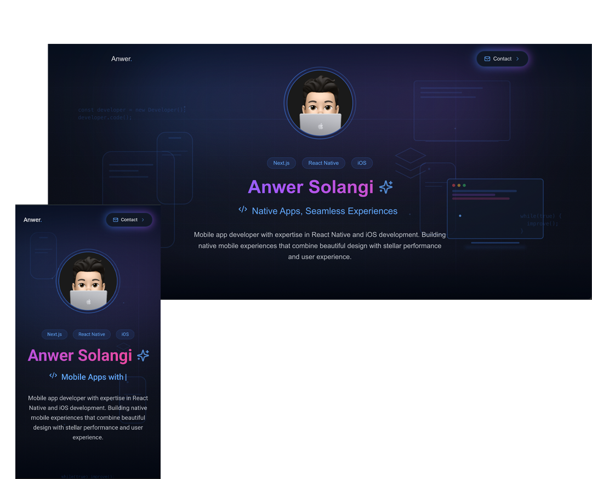

<div align="center">
  
</div>

<h1 align="center">Portfolio Website</h1>

<p align="center">
  My portfolio website built with Next.js and TailwindCSS, featuring a modern design with elegant animations.
  <br/>
  <a href="https://anwersolangi.com"><strong>View Live Demo »</strong></a>
</p>

<p align="center">
  <a href="https://github.com/anwersolangi/Devfolio/issues">Report Bug</a> ·
  <a href="https://github.com/anwersolangi/Devfolio/issues">Request Feature</a>
</p>

## ✨ Features

- ⚡️ Built with Next.js 15 and React 19
- 💎 Styled with Tailwind CSS
- 🎨 Modern and responsive design
- 🌟 Smooth animations and transitions
- 📱 Mobile-first approach
- 🎯 SEO optimized
- 📖 Clean project structure
- 🚀 Fast performance

## 🛠 Tech Stack

- [Next.js](https://nextjs.org)
- [React](https://reactjs.org)
- [Tailwind CSS](https://tailwindcss.com)
- [Lucide Icons](https://lucide.dev)
- [TypeScript](https://www.typescriptlang.org)

## 🚀 Getting Started

### Prerequisites

- Node.js 18+ and npm

### Installation

1. Clone the repository

   ```sh
   git clone https://github.com/anwersolangi/Devfolio.git
   ```

2. Install dependencies

   ```sh
   npm install
   ```

3. Create a `.env.local` file in the root directory and add your environment variables:

   ```env
   NEXT_PUBLIC_BASE_URL=http://localhost:3000
   ```

4. Start the development server

   ```sh
   npm run dev
   ```

5. Open [http://localhost:3000](http://localhost:3000) with your browser to see the result.

## 📂 Project Structure

```
portfolio/
├── app/
│   ├── layout.tsx
│   ├── page.tsx
│   └── metadata.ts
├── components/
│   ├── About/
│   ├── AppCard/
│   ├── Background/
│   ├── Experience/
│   ├── Footer/
│   ├── Header/
│   └── Hero/
├── public/
│   └── assets/
├── styles/
│   └── globals.css
└── types/
```

## 🎨 Customization

1. **Personal Information**: Update your information in `app/metadata.ts`

2. **Content**: Modify components in the `components` directory:

   - Update bio in `components/About/About.tsx`
   - Modify experience in `components/Experience/Experience.tsx`
   - Add your apps in `components/AppCard/AppCard.tsx`

3. **Styling**: Customize the look in `tailwind.config.js` and `styles/globals.css`

4. **Images**: Replace images in the `public` directory with your own

## 🚀 Deployment

The easiest way to deploy this portfolio is to use the [Vercel Platform](https://vercel.com). Check out the [Next.js deployment documentation](https://nextjs.org/docs/deployment) for more details.

[](https://vercel.com/new/git/external?repository-url=https://github.com/anwersolangi/portfolio)

## 🤝 Contributing

Contributions are welcome! Please feel free to submit a Pull Request. For major changes, please open an issue first to discuss what you would like to change.

1. Fork the Project
2. Create your Feature Branch (`git checkout -b feature/AmazingFeature`)
3. Commit your Changes (`git commit -m 'Add some AmazingFeature'`)
4. Push to the Branch (`git push origin feature/AmazingFeature`)
5. Open a Pull Request

## 📝 License

This project is licensed under the MIT License - see the [LICENSE](LICENSE) file for details.

## 👤 Contact

Anwer Solangi - [@anwerxolangi](https://twitter.com/anwerxolangi)

Project Link: [https://github.com/anwersolangi/portfolio](https://github.com/anwersolangi/Devfolio)

## 🙏 Acknowledgments

- [Next.js](https://nextjs.org)
- [Tailwind CSS](https://tailwindcss.com)
- [Vercel](https://vercel.com)
- [Lucide Icons](https://lucide.dev)
